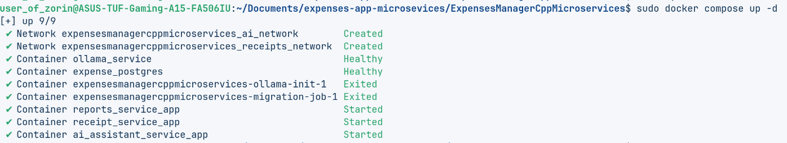

# _CPP Microservices application_
## _Expenses-manager microservices_
___   

### _Tech stack:_   
- _[Modern C++ 17/20](https://isocpp.org/)_  
- _[Drogon — C++17/20-based HTTP application framework](https://drogon.org/) || [[GIT]](https://github.com/drogonframework/drogon)_  
- _[Crow.cpp — C++ framework for creating HTTP or Websocket web services](https://crowcpp.org/)_
- _[Docker, Docker-Compose](https://www.docker.com/)_  
- _[PostrgreSQL](https://www.postgresql.org/)_
- _[Liquibase](https://www.liquibase.com/) for DB migrations_  
- _[OpenCode](opencode.ai) + [Alibaba Model Studio](https://www.alibabacloud.com/en?_p_lc=1) for consultations and boilerplate code generation_  
- _[Langchain](https://www.langchain.com/) + [Ollama](https://ollama.com/) + [Fastify](https://fastify.dev/)_  
- _[GitHub Actions CI](https://github.com/features/actions) for some auto-build&deploy of Docker-images_

___  
### _Installation [for local]:_  
- Fill .env with necessary DB data (see [.env.example](./.env.example) for reference)  
- If running services locally - make sure that configuration in CLion includes environment string same as in .env file  
- If running locally make cure, you have GNU supporting C++ 20 standard, and mentioned libs above. I have GNU 14 (GCC 14, G++ 14).    
- Make sure you have all libs installed. **Hint: you may use Dockerfile in REPORTS and RECEIPT microservices just to copy installations of C++ libs.**    

___  

### Running via Docker:  
`sudo docker compose up -d`  


___  
### _Hints:_   
 
##### If GPU not available for Ollama:  
- `sudo apt-get install -y nvidia-container-toolkit`  
- `sudo nvidia-ctk runtime configure --runtime=docker`  
- `sudo systemctl restart docker`   

##### If no internet inside Docker container
- `sudo nano /etc/docker/daemon.json`
- Insert there:
```json
{
  "dns": ["8.8.8.8", "1.1.1.1"]
}
```  
- `Ctrl+O`, `Enter`, `Ctrl+X`  
- `sudo systemctl restart docker`    

##### k8s tutorial:  
- Check Dockerfile in every microservice
- `sudo minikube delete --all`  
- `sudo usermod -aG docker $USER`  
- `newgrp docker`  
- `minikube start --driver=docker`  
- `minikube status`  
- `minikube image build -t receipt-service:dev ./receipt-service/`  
- `minikube image build -t reports-service:dev ./reports-service/`  
- `minikube image build -t ai-assistant-service:dev ./ai-assistant-service/`  
- `minikube image build -t liquibase-expenses:dev ./liquibase/`  
- `kubectl create namespace expenses`  
- `kubectl config set-context --current --namespace=expenses`  
- `kubectl create secret generic app-env --from-env-file=.env`  
- To check env keys `kubectl describe secret app-env`  
	- After changing ENV: 
	- `kubectl create secret generic app-env --from-env-file=.env \
  --dry-run=client -o yaml | kubectl apply -f -
kubectl rollout restart deployment/receipt-service deployment/reports-service`  

- `mkdir k8s`  
- Create files: 
  - `k8s/postgres.yaml`
  - `k8s/migration-job.yaml`, 
  - `k8s/ollama.yaml`, 
  - `k8s/receipt-service.yaml`, 
  - `k8s/reports-service.yaml`,
  - `k8s/ai-assistant-service.yaml`  

- Apply manifests in order (dependencies first):  
```bash
kubectl apply -f k8s/postgres.yaml
kubectl wait --for=condition=available deployment/postgres --timeout=120s
kubectl apply -f k8s/migration-job.yaml
kubectl wait --for=condition=complete job/migration-job --timeout=300s
kubectl apply -f k8s/ollama.yaml
kubectl wait --for=condition=complete job/ollama-init --timeout=600s
kubectl apply -f k8s/receipt-service.yaml -f k8s/reports-service.yaml -f k8s/ai-assistant-service.yaml
```
- NodePorts: receipt `30400`, reports `30401`, ai-assistant `30402`. Use `minikube service receipt-service` for a tunnel.  
- Re-running migrations: `kubectl delete job migration-job && kubectl apply -f k8s/migration-job.yaml`  


